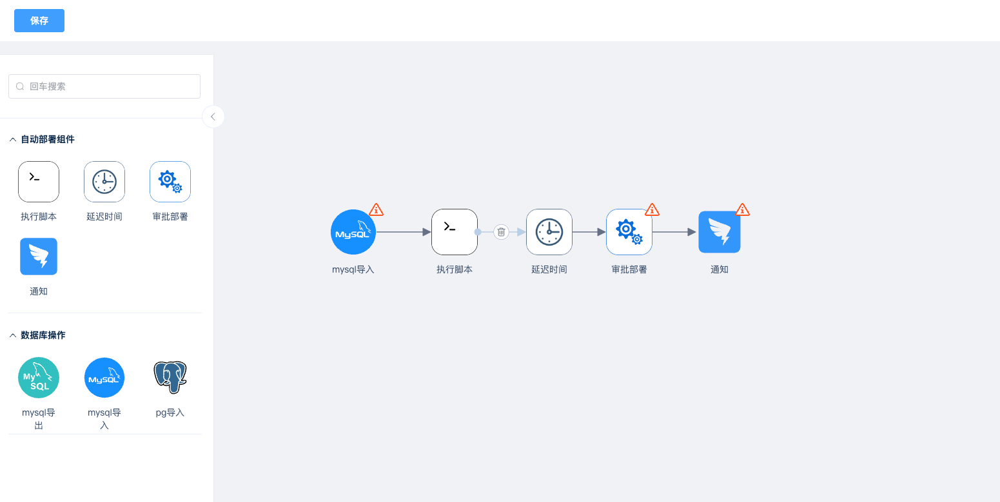

# Readme

本仓库fork自建木，根据自己公司的实际情况修改了一下,实现图形化工作流



原仓库地址： https://gitee.com/jianmu-dev/jianmu


# 运行

```
## 安装依赖
yarn install
## 启动
npm run dev
##
访问 http://127.0.0.1:3000
```

# 路由
- / 流程图
- /view 预览